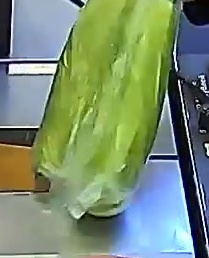
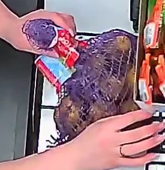

# 🥇 1st Place Solution: Fruits & Vegetables Classification on Store Scales


 


Этот репозиторий содержит решение, занявшее **1-е место** на соревновании Kaggle по классификации изображений 15 классов овощей и фруктов на весах в супермаркете.

## 📌 О задаче
Разработка системы компьютерного зрения для автоматического распознавания товаров на весах самообслуживания. 
**Сложности данных:**
* Различное разрешение и соотношение сторон (обработано через `LongestMaxSize` и `Padding`).
* Сложные условия освещения и наличие посторонних предметов (пакеты, руки).
* Дисбаланс классов (использованы `Class Weights`).

## 🚀 Основные фишки решения
Для достижения 1-го места были внедрены передовые методики обучения и инференса:

1.  **Model Ensemble (6 Folds):** Итоговое решение базируется на ансамбле из 6 моделей, обученных с применением `StratifiedKFold`.
2.  **Weighted F1-Averaging:** При инференсе реализовано взвешенное усреднение: вклад каждого фолда в финальный результат пропорционален его `Macro F1-score`.
3.  **Advanced Regularization (Mixup & Cutmix):** Использование стратегий смешивания изображений `Mixup` (alpha=0.4) и `Cutmix` (alpha=1.0) для повышения обобщающей способности.
4.  **TTA (Test Time Augmentation):** При инференсе применялся 4-way TTA (оригинал + Horizontal/Vertical/HV Flips), что повысило стабильность предсказаний.

## 🏗️ Архитектура и Обучение
*   **Backbone:** `EfficientNet-V2-S`, предобученная на ImageNet-21k.
*   **Validation:** Основная метрика — **Macro F1-Score**. Мониторинг велся по каждой эпохе с сохранением лучших весов.
*   **Augmentations:** Помимо Mixup/Cutmix, использовался пайплайн `Albumentations`: *ColorJitter, CLAHE, GaussianBlur, GaussNoise, CoarseDropout*.
*   **Loss Function:** 
    *   *Train:* `SoftTargetCrossEntropy` (необходима для работы с "мягкими" метками после Mixup).
    *   *Val:* `CrossEntropyLoss` с **Label Smoothing (0.1)**.
*   **Optimizer & Scheduler:** `AdamW` (lr: 3e-4, weight decay: 1e-2) + `CosineAnnealingLR`.

## 📊 Результаты
*   **Место:** 1 из 16 команд.
*   **Private Score (F1):** `0.96163`

## 📂 Структура проекта
```text
├── data/               # Данные
├── src/                # Модули (Dataset, Engine, Config, Utils)
├── models/             # Веса обученных моделей 
├── train.py            # Скрипт запуска обучения
├── predict.py          # Скрипт для инференса (Ensemble + TTA)
└── requirements.txt    # Зависимости
```

## 💻 Как запустить

1. **Установка зависимостей:**
   ```bash
   pip install -r requirements.txt
   ```
2. **Обучение:**
   ```bash
   python train.py
   ```
3. **Инференс:**
   ```bash
   python predict.py --image path/to/image.jpg --ckpt_dir models/
   ```

## 📊 Данные
Данный датасет является частью закрытого соревнования Kaggle. В соответствии с правилами, исходные изображения не могут быть выложены в открытый доступ.

**Характеристики данных:**
* 15 классов овощей и фруктов.
* 10 145 фотографий.
* Общий объем: 157 МБ.

## 🖼️ Пример работы
| Изображение | Результат модели | Уверенность |
| :---: | :---: | :---: |
|  | **Кабачки** | 64.38% |
|  | **Картофель** | 80.82% |
|  | **Яблоки красные** | 77.51% |